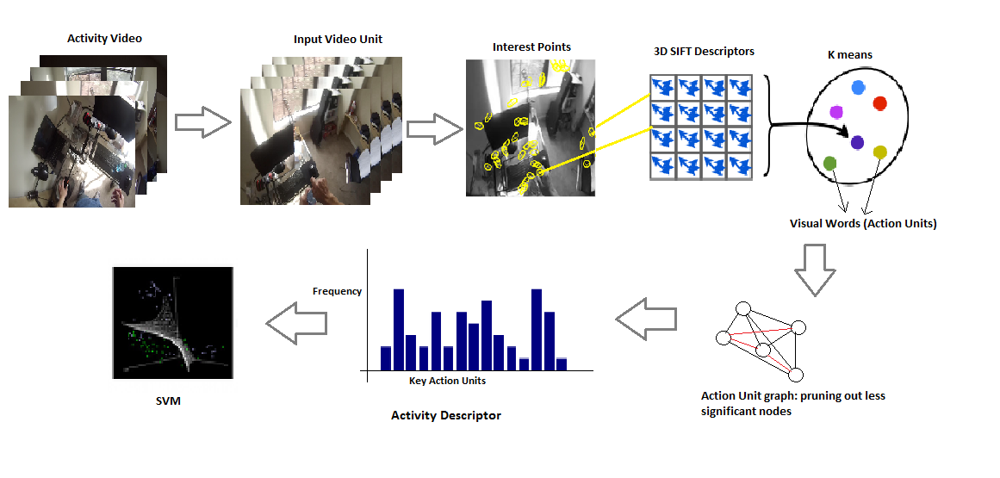

# Activity-Recognition-in-Egocentric-Videos

K. Sai Suma, Gedela Aditya and Snehasis Mukherjee, Activity Recognition in Egocentric Videos Using Bag of Key Action Units, Proc. of ICVGIP 2018, IIIT Hyderabad, ACM, pp.- 9:1-9:9.

### Abstract:
• In this paper we present a novel methodology for recognizing human activity in Egocentric video based on the Bag of Visual Features. The proposed technique is based on the assumption that, only a portion of the whole video can be sufficient to identify an activity. 

• The proposed approach divides the video into smaller video segments called Video Units. Spatio-temporal features extracted from the units, are clustered to construct the dictionary of Action Units (AU). 

• The AUs are ranked based upon their score of likeliness. The scores are obtained by constructing a weighted graph with the AUs as vertices and edge weights calculated based on the frequencies of occurrences of the AUs during the activity.

• The less significant AUs are pruned out from the dictionary, and the revised dictionary of key AUs are used for activity classification.

### Block Diagram of our Approach:

### Steps Involved:

### FPPA Dataset:

